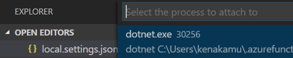
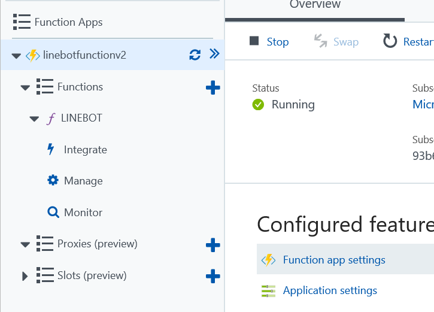
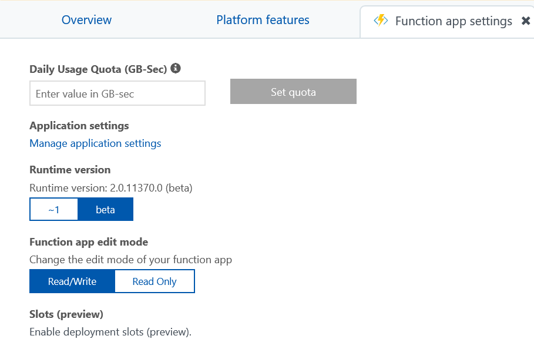
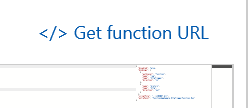

# C# Azure Function v2 Sample for LINE Messaging API

[日本語の説明はこちら](./README_JP.md)

This folder contains C# Azure Function v2 sample for LINE Messaging API. As it's dotnet core 2.0 base, it runs on multi-platform such as Windows, Mac or Linux.

# Setup
## [Prerequisites]
You need to install followings.

- [Azure Subscription](https://azure.microsoft.com)
- [Visual Studio Code](https://code.visualstudio.com/)
- [git](https://git-scm.com/downloads)
- [Node 8.5.0 or higher](https://nodejs.org/en/download/releases/)
- [dotnet core](https://www.microsoft.com/net/download/core)
- [Azure Functions Core Tools 2.0 aka @core](https://www.npmjs.com/package/azure-functions-core-tools)
    
    Run the following command after you installed Node.js.<br/>
    ``` npm i -g azure-functions-core-tools@core ```
    
    for Mac, run the following command instead if above command didn't work.<br/>
    ``` sudo npm i -g azure-functions-core-tools@core --unsafe-perm ```

    Please note that Azure Function Tool has version 1.0 as well, which is Windows only. If you prefer to use v1, then go to [FunctionAppSample](https://github.com/pierre3/LineMessagingApi/tree/master/FunctionAppSample) instead.
- [Azure CLI 2.0](https://docs.microsoft.com/en-us/cli/azure/install-azure-cli?view=azure-cli-latest)
- [LINE Developer Account and Messaging API application](https://developers.line.me/en/)
- [ngrok (for local test)](https://ngrok.com/)

## [Get the source code]
You can download zip file or use git clone command to copy source. You only need FunctionAppSample.v2 folder though.

## [Config update]
Fill the parameters in local.settings.json

 - AzureWebJobsStorage: Azure Storage connection string
 - ChannelSecret: LINE Messaging API Channel Secret
 - ChannelAccessToken: LINE Messaging API AccessToken

# Compile, Test and Publish
## [Compile]
Use dotnet command to compile the app.
1. In command prompt or terminal, go to FunctionAppSample.v2.
2. Run ``` >dotnet build ``` for debug build, or ``` >dotnet build -c Release ``` for release build.

## [Test locally]
If you want to test it locally, do the following.
1. In command prompt or console, execute ``` >code .``` to open folder in Visual Studio Code
1. In command prompt or console, go to bin\Debug\netstandard2.0 directory.
1. Run command: ``` >func host start --debug vscode ``` to start the function. Check the port number. (7071 by default.)
1. From Visual Studio Code, hit "F5" key, and select "dotnet.exe". If the status bar becomes "orange" color, then you are in debug mode. <br/>

1. Open another command prompt or console and run ```>ngrok http --host-header=localhost:7071 7071``` Change the port number appropriately. Copy the output of ngrok address. <br/>

1. Go to [Line Developer Console](https://developers.line.me/console/) and open the Messaging API application.
1. Update "Webhook URL Requires SSL" setting for ngrok URL. Do not forget to add /api/LineBot at the end, then save. <br/>


Now when you send message to the bot via LINE application, the request is routing to the local instance, thus you can debug it.

Whenever you need to chagne the code, just stop the function app only, and do not end ngrok session. As long as you keep running the ngrok session, you can keep using the same ngrok URL for debug.

## [Publish the Function]
The func command provides publish feature.
1. Create Azure Functions app in your Azure subscription. Select any region as you want.
1. Open command prompt or console and move to /bin/Release/netstandard2.0 directory.
1. Run ```>func azure login``` and follow the instruction to login to your Azure subscription.
1. Run ```>func azure functionapp publish <FunctionsAppName> -i -y```. The -i option updates App Settings for the function app in Azure during deployment, and -y option over
writes AppSettings in Azure with local value if different. If you didn't specify these options, you need to manually update application settings in Azure Porta.)
1. Wait untill publish completes.
1. Once publish is done, open Azure Functions in Azure Portal and go to "Function Settings" <br/>

1. Then change the runtime to "preview", which makes the app run in version 2.x runtime. "beta" label may be changing in the future, and just select "version 2" in that case. <br/>

1. Expand the Functions and select LINEBOT function. Click "Get Function URL" and copy the URL. <br/>

1.  Go to [Line Developer Console](https://developers.line.me/console/) and open the Messaging API application.
1. Update "Webhook URL Requires SSL" setting for Azure Function URL, then save.
1. Send message to the bot from LINE application.

Enjoy!