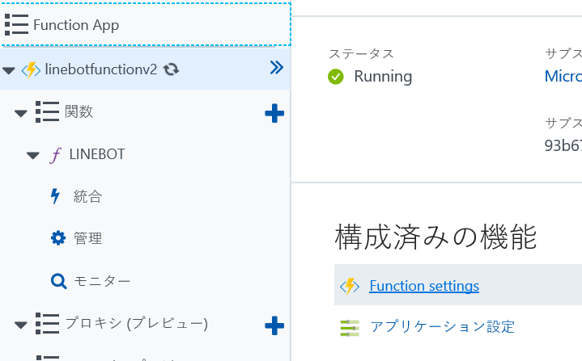
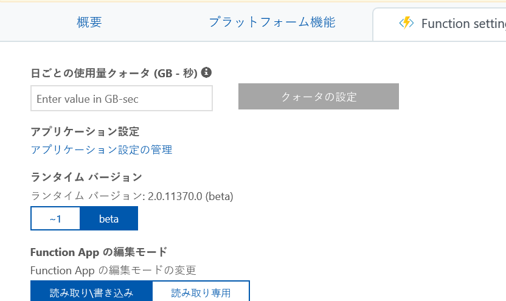
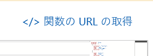

# LINE Messaging API 用 C# Azure ファンクション v2 サンプル

このフォルダには、Windows や Mac、Linux などマルチプラットフォームで実行可能な dotnet core 2.0 ベースの LINE Messaging API 用C# Azure ファンクション v2 サンプルが含まれます。

# セットアップ
## [前提条件]
以下のモジュールが必要です。

- [Azure サブスクリプション](https://azure.microsoft.com)
- [Visual Studio Code](https://code.visualstudio.com/)
- [git](https://git-scm.com/downloads)
- [Node 8.5.0 以降](https://nodejs.org/en/download/releases/)
- [dotnet core](https://www.microsoft.com/net/download/core)
- [Azure Functions Core ツール 2.0 aka @core](https://www.npmjs.com/package/azure-functions-core-tools)
    
    以下のコマンドでインストール可能です。<br/>
    ``` npm i -g azure-functions-core-tools@core ```
    
    Mac で上記コマンドでインストールが失敗する場合は、以下コマンドを実行します。<br/>
    ``` sudo npm i -g azure-functions-core-tools@core --unsafe-perm ```

    Azure Function ツールは Windows 専用のバージョン 1.0 も存在するため、導入のバージョンに気を付けてください。バージョン 1.0 を利用する場合は、[FunctionAppSample](https://github.com/pierre3/LineMessagingApi/tree/master/FunctionAppSample) を参照してください。
- [Azure CLI 2.0](https://docs.microsoft.com/en-us/cli/azure/install-azure-cli?view=azure-cli-latest)
- [LINE 開発者アカウントおよび Messaging API アプリケーション](https://developers.line.me/en/)
- [ngrok (ローカルテスト用)](https://ngrok.com/)

## [ソースコードの取得]
zip ファイルをダウンロードして解凍するか、git clone コマンドでレポジトリをコピーします。実際に必要なものは FunctionAppSample.v2 フォルダにあります。

## [構成の更新]
local.settings.json の設定を更新します。

 - AzureWebJobsStorage: Azure ストレージの接続文字列
 - ChannelSecret: LINE Messaging API チャネルシークレット
 - ChannelAccessToken: LINE Messaging API アクセストークン

# コンパイル、テストおよび公開
## [コンパイル]
dotnet コマンドでコンパイルします。
1. コマンドプロンプトやターミナルで FunctionAppSample.v2 フォルダに移動。
1. デバッグビルドの場合は、``` >dotnet build ``` 、リリースビルドの場合は ``` >dotnet build -c Release ``` を実行。

## [ローカルでのテスト]
ローカルでデバッグテストをしたい場合は、以下の手順を行います。
1. コマンドプロンプトやターミナルで ``` >code .``` を実行して Visual Studio Code を起動。
1. コマンドプロンプトやターミナルで bin\Debug\netstandard2.0 ディレクトリに移動。
1. ``` >func host start --debug vscode ``` を実行してファンクションを実行。起動時に実行ポートを確認。(既定は 7071)
1. Visual Studio Code で F5 を押下し、"dotnet.exe" を選択。ステータスバーがオレンジになるとデバッグ開始。 <br/>

1. 別のコマンドプロンプトやターミナルウィンドウを開いて、```>ngrok http --host-header=localhost:7071 7071``` を実行。ポートは環境に合わせて変更。出力された ngrok のアドレスをコピー。 <br/>

1. [Line 開発者コンソール](https://developers.line.me/console/) を開き、Messaging API アプリケーションを開く。
1. "Webhook URL Requires SSL" 設定を ngrok URL に変更。/api/LineBot をつけ忘れないように注意。<br/>


この状態で LINE アプリケーションよりボットにメッセージを送ると、ローカルのデバッグ環境に送信されます。コードを変更したい場合はファンクションの実行を Ctrl+C でキャンセルするだけで、ngrok のセッションは止めないでください。セッションが有効な限り、LINE 側の設定変更は不要です。

## [ファンクションの公開]
func コマンドで公開も可能です。
1. Azure ポータルより、Azure ファンクションアプリを任意のリージョンに作成。
1. コマンドプロンプトやターミナルで /bin/Release/netstandard2.0 ディレクトリに移動。
1. ```>func azure login``` コマンドを実行し、ウィザードに従ってAzure サブスクリプションにログイン。
1. ```>func azure functionapp publish <FunctionsAppName> -i -y```. コマンドでファンクションを公開。-i オプションで Azure 側のアプリケーション設定をローカルの値で更新。-y オプションを指定すると、値がある場合にも上書きを行う。オプションを省略した場合は手動でアプリケーション設定値を追加/更新。
1. 公開が終わるまで待つ。
1. 公開が終わったら、Azure ポータルより Azure Functions の"Function Settings" を開く。<br/>

1. ランタイム バージョンを beta に変更。 バージョンが 2.x になることを確認。将来的にはラベルが変更される可能性があるが、その場合もバージョン 2.x を選択。 <br/>

1. 関数を展開して、LINEBOT を選択。”関数の URL を取得” をクリックして、アドレスをコピー。 <br/>

1. [Line 開発者コンソール](https://developers.line.me/console/) より Messaging API アプリケーションを開く。
1. "Webhook URL Requires SSL" 設定を行更新。
1. LINE アプリケーションよりボットにメッセージを送信して動作確認。