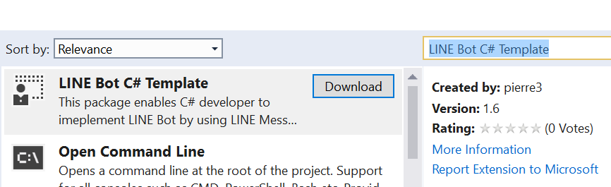
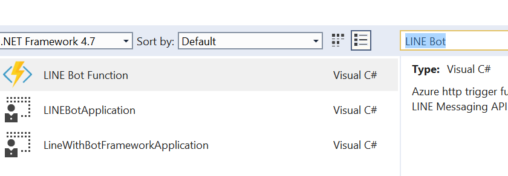

# C# LINE Messaging API Visual Studio Templates

[日本語の説明はこちら](./README_JP.md)

This folder contains Visual Studio Extension project for C# Project templates. The compiled vsix is on [Visual Studio Marketplace](https://marketplace.visualstudio.com/items?itemName=pierre3.LINEBotCSharpTemplate) as Visual Studio Extension.

In this README, you see how to import the extension to Visual Studio and use it.

# How to use the extension

## Install the extension
1. Open Visual Studio and go to Tools | Extensions and Updates.
1. Select "Online" on the left pane and search for "LINE Bot C# Template", and click "Download".  

1. Restart Visual Studio and it will be installed.

## Use the project templates  
Once you installed the extension, it's straight forward.

1. Open Visual Studio and "Create new project".
1. Search "LINE Bot" and you see several projcts comes up.  
  
1. Select any project to start.

For detail, checkout each directory in this repository.
