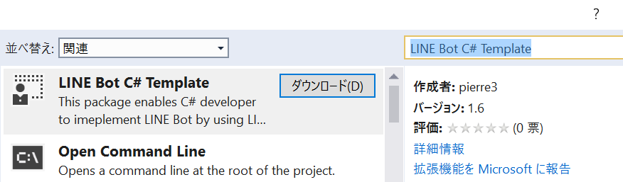
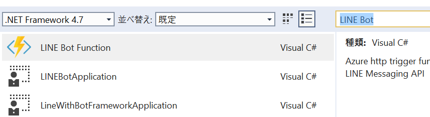

# C# LINE Messaging API Visual Studio テンプレート

このディレクトリでは C# 版 LINE Messaging API プロジェクトテンプレート用の Visual Studio 拡張プロジェクトのソースを公開しています。コンパイル済みの VSIX は [Visual Studio マーケットプレース](https://marketplace.visualstudio.com/items?itemName=pierre3.LINEBotCSharpTemplate) に公開済です。

# 拡張機能の使い方

## 拡張のインストール
1. Visual Studio を開いて、ツール | 拡張機能と更新プログラムを選択。
1. 左ペインの "オンライン" を選択して、"LINE Bot C# Template" を検索し、"ダウンロード" をクリック。  

1. Visual Studio を再起動するとインストールが完了。

## テンプレートを使う  
インストールが終われば後は簡単です。

1. Visual Studio を開いて、新しいプロジェクトを作成。
1. "LINE Bot" で検索すると複数のプロジェクトテンプレートが表示される。  
  
1. 利用したいプロジェクトを選択。

各テンプレートの詳細はそれぞれのフォルダをご覧ください。