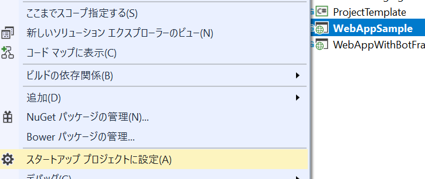
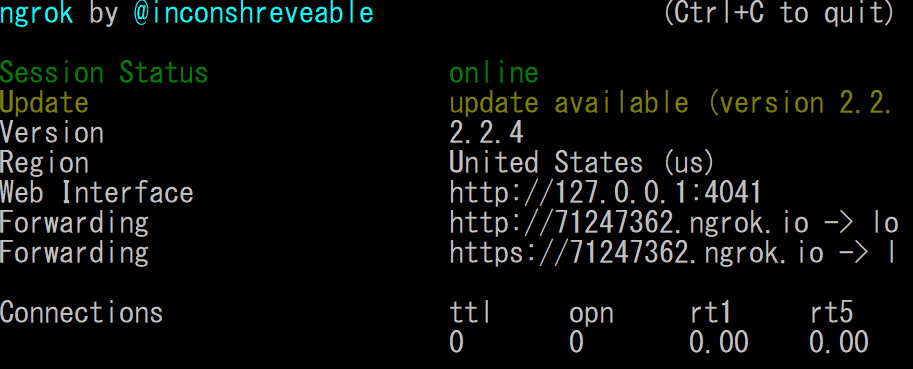
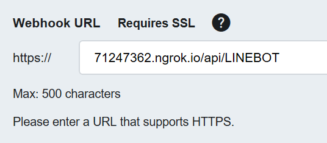

# LINE Messaging API 用 C# Web App (API) サンプル

このフォルダには、LINE Messaging API 用 C# Web App (API) サンプルが含まれています。ソリューションは .NET Framework 4.6.2 ベースです。Visual Studio テンプレートより同様のプロジェクトを作成することも可能です。[Visual Studio マーケットプレース](https://marketplace.visualstudio.com/items?itemName=pierre3.LINEBotCSharpTemplate).

# セットアップ
## [前提条件]
以下のモジュールが必要です。

- [Azure サブスクリプション](https://azure.microsoft.com)
- [Visual Studio および ASP.NET と Web 開発ワークロード](https://www.visualstudio.com/vs/)
- [git](https://git-scm.com/downloads)
- [.NET Framework 4.6.2](https://www.microsoft.com/net/download/visual-studio-sdks)
- [LINE 開発者アカウントおよび Messaging API アプリケーション](https://developers.line.me/en/)
- [ngrok (ローカルテスト用)](https://ngrok.com/)

## [ソースコードの取得]
zip ファイルをダウンロードして解凍するか、git clone コマンドでレポジトリをコピーします。テンプレートからも同様のプロジェクトを作成できます。

## [構成の更新]
Web.config の設定を更新します。

 - StorageConnectionString: Azure ストレージの接続文字列
 - ChannelSecret: LINE Messaging API チャネルシークレット
 - ChannelAccessToken: LINE Messaging API アクセストークン

# コンパイル、テストおよび公開
## [コンパイル]
Visual Studio でコンパイルします。
1. Visual Studio でソリューションを開く。
1. ビルドメニューより ”ソリューションのビルド” を実行します。必要に応じてデバッグやリリース構成を切り替え。

## [ローカルでのテスト]
ローカルでデバッグテストをしたい場合は、以下の手順を行います。
1. Visual Studio で Web App を右クリックし ”スタートアップ プロジェクトに設定” をクリック。

1. F5 を押下してデバッグを開始。ブラウザが開くのでポートを確認。(既定: 1590)
1. マンドプロンプトやターミナルを開いて、>ngrok http --host-header=localhost:1590 1590 を実行。ポートは環境に合わせて変更。出力された ngrok のアドレスをコピー。 

1. [Line 開発者コンソール](https://developers.line.me/console/) を開き、Messaging API アプリケーションを開く。
1. "Webhook URL Requires SSL" 設定を ngrok URL に変更。/api/LineBot をつけ忘れないように注意。  

この状態で LINE アプリケーションよりボットにメッセージを送ると、ローカルのデバッグ環境に送信されます。コードを変更したい場合は Visual Studio のデバッグ実行を停止するだけで、ngrok のセッションは止めないでください。セッションが有効な限り、LINE 側の設定変更は不要です。

## [Web App の公開]
Visual Studio から直接 Azure に公開できます。
1. プロジェクトを右クリックして、”発行” を選択。
1. ウィザードに従ってアプリケーションを公開。
1. ブラウザが開くので、URL を確認。
1. [Line 開発者コンソール](https://developers.line.me/console/) Messaging API アプリケーションを開く。
1. "Webhook URL Requires SSL" 設定を行更新。
1. LINE アプリケーションよりボットにメッセージを送信して動作確認。